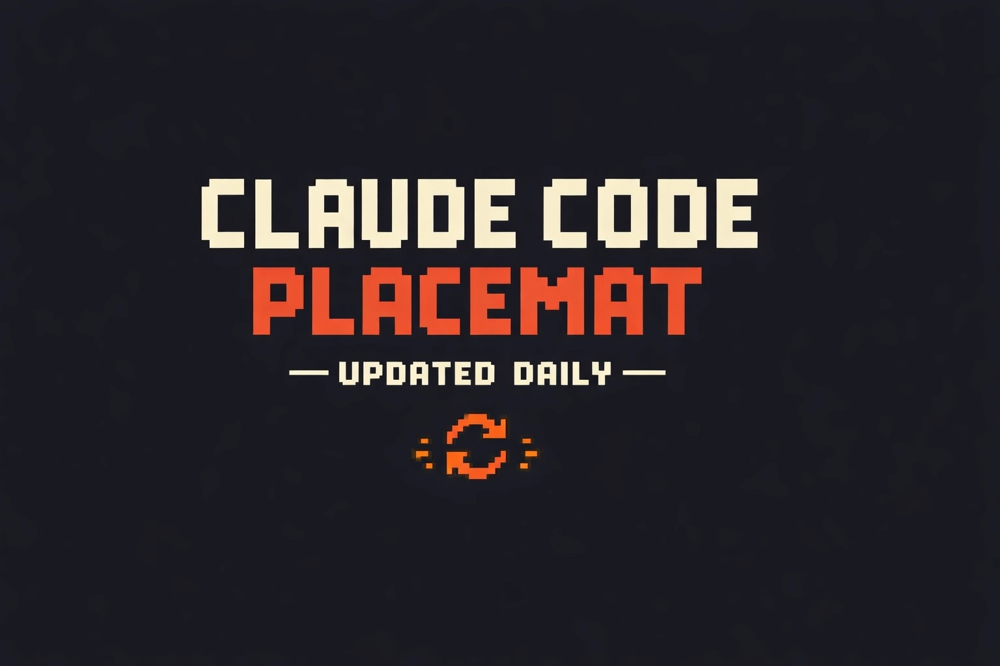

# Claude Code Placemat

  

Auto-updated single-page reference for Claude Code — commands, shortcuts, flags,
configuration, hooks, MCP, skills, and agents.

**Live:** https://dommango.github.io/claude-code-placemat/

## How It Stays Current

A cloud-scheduled Claude Code agent runs daily at 9am UTC.
It fetches the official changelog, diffs against the current placemat,
and auto-merges updates — no human in the loop.

### Update Process
1. Scheduled agent detects new CC release(s)
2. Parses changelog, maps changes to placemat sections
3. Updates index.html, changelog.html, and What's New popup data
4. Opens PR with change summary and self-review checklist
5. Auto-merges via squash
6. GitHub Pages auto-deploys

## Attribution

- **Initial compilation** — Based on reference material curated by
  [AI Edge](https://x.com/aiedge)
- **Automated updates** — Powered by
  [claude-changelog](https://github.com/jheur) by jheur
- **Placemat design & maintenance** — Built with
  [Claude Code](https://claude.ai/code)

## License

MIT
