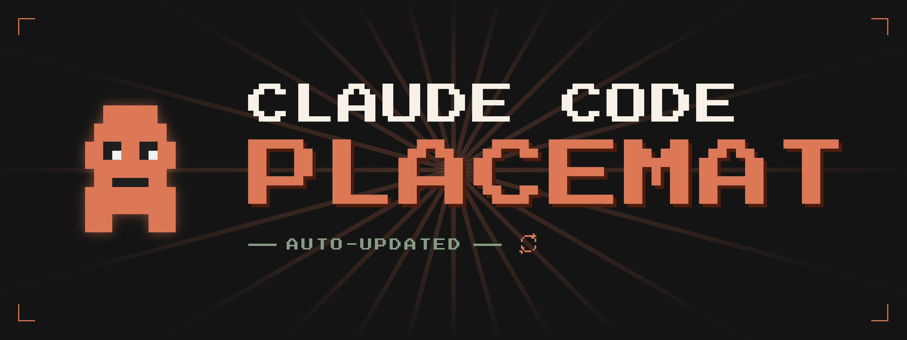

# Claude Code Placemat

<p align="center">
  
</p>

<p align="center">
  <a href="https://dommango.github.io/claude-code-placemat/"></a>
  <a href="LICENSE"></a>
  <a href="https://github.com/dommango/claude-code-placemat/actions"></a>
</p>

Auto-updated single-page reference for Claude Code — commands, shortcuts, flags,
configuration, hooks, MCP, skills, and agents.

**Live:** https://dommango.github.io/claude-code-placemat/

## How It Stays Current

A cloud-scheduled Claude Code agent runs daily at 9am UTC. It fetches the
official changelog, diffs against the current placemat, and opens a PR with the
delta — humans review and merge.

1. Scheduled agent detects new CC release(s)
2. Parses changelog, maps changes to placemat sections
3. Updates `index.html`, `changelog.html`, and the What's New popup data
4. Opens PR on a `claude/placemat-update-vX.Y.Z` branch with a change summary + self-review checklist
5. Human reviews & merges
6. GitHub Pages auto-deploys from `main`

## Local Preview

No build step — it's static HTML + CSS.

```bash
python3 -m http.server 8000
# open http://localhost:8000
```

## Tests

Zero-dependency structural/regression checks — no npm install, just Node:

```bash
node tests/placemat.test.js
```

## Contributing

Humans and bots both welcome. See [CONTRIBUTING.md](CONTRIBUTING.md) for the split:
the bot owns CC-release sync; humans own design, bug fixes, style-guide tweaks,
and manual content corrections. Security issues → [SECURITY.md](SECURITY.md).

## Attribution

- **Initial compilation** — Based on reference material curated by
  [AI Edge](https://x.com/aiedge)
- **Automated updates** — Powered by
  [claude-changelog](https://github.com/jheur) by jheur
- **Placemat design & maintenance** — Built with
  [Claude Code](https://claude.ai/code)

## License

[MIT](LICENSE)
